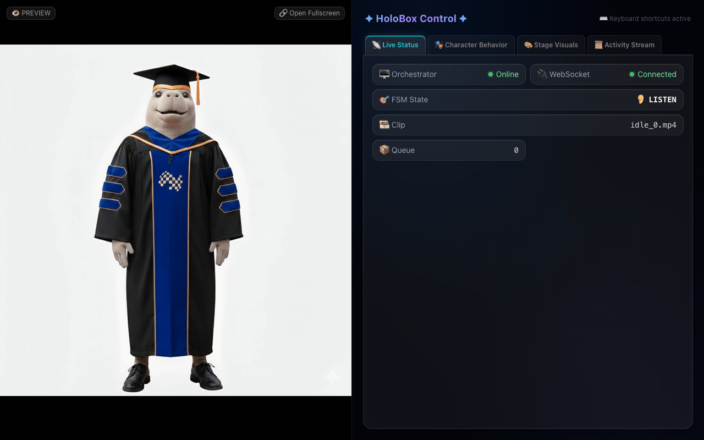
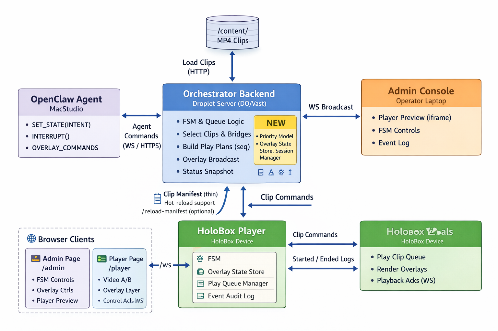

<div align="center">
  <a href="https://github.com/Doldrums/meetdugong">
    
  </a>

  <h1>Dugong</h1>

  <h3>The Embodied K2 Agent for Physical and Digital Spaces</h3>

  <br/><br/>

  [](https://meetdugong.live)
  [](https://meetdugong.live/status)

  <br/>

  | | Link | Description |
  |---|------|-------------|
  | 🌐 | [**meetdugong.live**](https://meetdugong.live) | Production — Admin Panel |
  | 🎬 | [**meetdugong.live/player**](https://meetdugong.live/player) | Holographic Player |
  | 🔍 | [**meetdugong.live/player?debug=1**](https://meetdugong.live/player?debug=1) | Player + Debug HUD |
  | 📡 | [**meetdugong.live/status**](https://meetdugong.live/status) | API Health Check |
  | 📋 | [**meetdugong.live/manifest**](https://meetdugong.live/manifest) | Clip Manifest JSON |

  <br/>

  [](https://react.dev)
  [](https://typescriptlang.org)
  [](https://tailwindcss.com)
  [](https://vite.dev)
  [](https://zustand.docs.pmnd.rs)
  [](https://expressjs.com)
  [](https://github.com/websockets/ws)
  [](https://nodejs.org)
  [](https://docs.docker.com/compose/)
  [](https://caddyserver.com)
  [](https://pnpm.io)

</div>

<details>
<summary><strong>Table of Contents 📜</strong></summary>

- [🌟 Overview](#-overview)
- [🧠 System Architecture](#-system-architecture)
- [🏗️ HoloBox Web Runtime](#️-holobox-web-runtime)
- [🎯 Features](#-features)
  - [🎬 Player](#-player)
  - [🎛️ Admin](#️-admin)
  - [🖥️ Backend](#️-backend)
- [🛠️ Tech Stack](#️-tech-stack)
- [📂 Project Structure](#-project-structure)
- [🚀 Getting Started](#-getting-started)
  - [📋 Prerequisites](#-prerequisites)
  - [📥 Install](#-install)
  - [💻 Development](#-development)
  - [✅ Type Checking](#-type-checking)
  - [📦 Production Build](#-production-build)
  - [🐳 Docker](#-docker)
- [🎬 Content System](#-content-system)
  - [📁 Clip Categories](#-clip-categories)
  - [📦 Current Content Inventory](#-current-content-inventory)
  - [➕ Adding a New State](#-adding-a-new-state)
  - [🌉 Bridge Resolution](#-bridge-resolution)
- [📡 WebSocket Protocol](#-websocket-protocol)
  - [⬆️ Control Events (Client → Server)](#️-control-events-client--server)
  - [⬇️ Broadcast Events (Server → All Clients)](#️-broadcast-events-server--all-clients)
- [⌨️ Keyboard Shortcuts](#️-keyboard-shortcuts)
- [🌐 Deployment](#-deployment)
- [🎨 Design System](#-design-system)

</details>

<div align="center">

  > _"The environment becomes the response."_

  ### 🎬 Character Gallery

  #### 🔄 Idle Loops

  
  
  
  
  

  #### 🎭 Actions

  
  
  
  
  

  #### 🌉 Bridge Transitions

  
  

  <sub>📹 3s previews @ 12fps · generated from <code>content/</code></sub>

  #### 📹 Demo

  
  

</div>

---

## 🌟 Overview

**Dugong** is an embodied K2-powered agent that transforms foundation model reasoning into dynamically generated spatial interfaces. Unlike traditional AI systems that output text, Dugong converts reasoning, planning, and agent execution into real-time environment synthesis across physical (HoloBox) and digital (web/mobile) platforms.

> **Dugong does not merely respond. It constructs.**

The system introduces a new output modality for foundation models:
- From **language** → to **space**
- From **response** → to **construction**
- From **interface** → to **environment**

Built for **MBZUAI** (Mohamed bin Zayed University of Artificial Intelligence), Dugong is deployed as an embodied AI character on a holographic display kiosk — with the environment itself serving as the primary output surface for intelligence.

<p align="center">
  
</p>

---

## 🧠 System Architecture

Dugong operates as a **runtime interface compiler** that translates natural language intent, contextual memory, and agent tool outputs into scene graphs, dynamic UI components, and interactive spatial elements.

| Layer | Component | Responsibility |
|-------|-----------|----------------|
| **Intelligence** | **K2 Think V2** | Multi-step reasoning, task decomposition, structured planning, visualization intent (JSON scene plans, action graphs) |
| **Intelligence** | **K2 V2** | Conversational synthesis, contextual explanation, narrative alignment with spatial outputs |
| **Orchestration** | **OpenClaw** | Stateful sessions, tool routing, plan execution, scene command dispatch, agent workflow management |
| **Scene Control** | **HoloBox Web Runtime** | Scene graph interpretation, runtime object rendering, data-driven UI components, animated state transitions |

```
User → Intent → K2 Think (Reasoning Plan) → OpenClaw (Agent Execution) → Scene Synthesis
```

Agent operations map directly to spatial transformations:

| Agent Operation | Spatial Result |
|-----------------|----------------|
| Plan Step | Object Instantiation |
| Tool Output | Data Panel Render |
| State Update | Scene Transition |
| Simulation | Animated Environment |
| Analysis Result | Visual Breakdown |

The avatar is the embodiment layer — the spatial reasoning engine is the product.

<p align="center">
  
</p>

---

## 🏗️ HoloBox Web Runtime

The HoloBox Web Runtime is Dugong's **Scene Control Layer** for physical deployment. A **Player** renders full-screen video with overlay graphics on the holographic display hardware, while an **Admin** panel gives operators real-time control over the character's state machine, overlays, and playback queue — all synchronized through WebSocket.

- ⚡ **Zero-latency transitions** between character states
- 🔄 **Seamless looping** with dual video buffer architecture
- 🎭 **HUD aesthetic** that complements the holographic medium
- 🎛️ **Operator-friendly controls** for live demonstrations

---

## 🎯 Features

### 🎬 Player

| | Feature | Description |
|---|---------|-------------|
| 🔀 | **Dual A/B video engine** | Two `<video>` elements swap seamlessly — standby preloads the next clip while active plays |
| 🌉 | **Bridge transitions** | Optional transition clips animate between FSM states (e.g. `idle_to_show_right.mp4`) |
| ⚡ | **Preemptive swap** | Crossfade triggers 150ms before clip end for zero-gap transitions |
| 🎭 | **Overlay system** | Composited layers for subtitles, info cards, QR codes — all with TTL auto-dismiss |
| 💠 | **HUD aesthetic** | Glassmorphism panels with animated gradients, shimmer bands, scanning lines, corner brackets, floating particles, and scrolling hex streams |
| 🔍 | **Debug HUD** | Minimal diagnostic overlay showing FSM state, current clip, WS & orchestrator status |
| 🔄 | **Idle loop** | Player autonomously cycles through randomized idle clips; server only sends explicit transitions |

### 🎛️ Admin

| | Feature | Description |
|---|---------|-------------|
| 🗺️ | **Interactive SVG state diagram** | Elliptical node layout with animated transition arcs, pulsing active state, pending state spinner, clip count badges |
| ⚡ | **Quick transitions** | One-click buttons for GREET, LISTEN, THINK, SPEAK, SHOW states |
| 🎨 | **Overlay presets** | Curated MBZUAI-themed subtitles, QR codes, map cards, and program cards |
| 📜 | **Real-time event log** | Color-coded, emoji-tagged log of all WS events (capped at 500 entries) with auto-scroll |
| 💚 | **System status** | Live orchestrator health, FSM state, current clip, queue depth |
| 📱 | **Responsive layout** | Side-by-side on desktop, bottom sheet on mobile — with embedded player preview iframe |

### 🖥️ Backend

| | Feature | Description |
|---|---------|-------------|
| 🧠 | **FSM orchestrator** | Unconstrained state machine (any → any) for maximum flexibility during development |
| 📋 | **Clip manifest scanner** | Filesystem scan at startup builds a typed manifest of all clips, bridges, and actions |
| 🌉 | **Bridge resolution** | Automatic bridge clip lookup with prefix matching and fallback exit-to-idle paths |
| 📡 | **WebSocket broadcast** | All state changes, playback events, and overlay commands broadcast to every connected client |
| 🔗 | **REST + WS hybrid** | REST endpoints for control events; WebSocket for real-time state sync |

---

## 🛠️ Tech Stack

| | Technology | Role |
|---|-----------|------|
| ⚛️ | **React 19** | Player & Admin UI |
| 🚀 | **Express 5** | API server, static file serving, SPA routing |
| 💎 | **TypeScript 5.8** | End-to-end type safety (shared types between server & client) |
| 🎨 | **Tailwind CSS 4** | Utility-first styling via Vite plugin (no PostCSS config) |
| 🐻 | **Zustand 5** | Lightweight state management (app, overlay, log stores) |
| 🔌 | **ws** | WebSocket server with broadcast and per-client messaging |
| ⚡ | **Vite 6** | Frontend dev server, HMR, production bundler |
| 📦 | **esbuild** | Server-side bundling to single ESM file |
| 🛣️ | **React Router 7** | Client-side SPA routing (`/admin`, `/player`) |
| 🐳 | **Docker** | Multi-stage production build (Node 22 slim) |
| 🔒 | **Caddy 2** | TLS-terminating reverse proxy with automatic HTTPS |
| 📦 | **pnpm** | Fast, disk-efficient package manager |

---

## 📂 Project Structure

```
iec/
├── content/
│   ├── actions/              # Character action clips (think_0.mp4, etc.)
│   ├── bridges/              # Transition clips (idle_to_show_right.mp4)
│   ├── idle_loops/           # Randomized idle clips (idle_0..4.mp4)
│   ├── images/               # Static images (idle thumbnails, etc.)
│   ├── interrupts/           # Reserved
│   └── utility/              # Reserved
├── web/
│   ├── shared/
│   │   ├── types.ts          # FSMState, ClipManifest, WS event types
│   │   └── constants.ts      # WS path, log buffer size, etc.
│   ├── server/
│   │   ├── index.ts          # Express app, HTTP + WS server setup
│   │   ├── routes.ts         # REST endpoints (/event, /status, /manifest)
│   │   ├── ws-server.ts      # WebSocket server with broadcast
│   │   ├── fsm.ts            # Finite state machine (unconstrained)
│   │   ├── orchestrator.ts   # Transition logic, bridge resolution, overlays
│   │   └── clip-manifest.ts  # Filesystem scanner, bridge filename parser
│   ├── src/
│   │   ├── pages/
│   │   │   ├── AdminPage.tsx  # Operator control panel
│   │   │   └── PlayerPage.tsx # Full-screen video player
│   │   ├── components/
│   │   │   ├── admin/         # FSMControls, OverlayControls, EventLog, etc.
│   │   │   └── player/        # VideoLayer, OverlayLayer, HudPanel, etc.
│   │   ├── hooks/
│   │   │   ├── useVideoSwitch.ts  # Dual A/B video buffer management
│   │   │   └── useWebSocket.ts    # WS lifecycle, reconnect, event dispatch
│   │   └── stores/
│   │       ├── appStore.ts     # FSM state, connection status, playback
│   │       ├── overlayStore.ts # Subtitle, card, QR overlay state + TTL
│   │       └── logStore.ts     # Event log ring buffer
│   ├── package.json
│   ├── tsconfig.json
│   └── vite.config.ts
├── Dockerfile
├── docker-compose.yml
├── Caddyfile
└── README.md
```

---

## 🚀 Getting Started

### 📋 Prerequisites

| Requirement | Version |
|------------|---------|
| Node.js | `22+` |
| pnpm | Latest (via `corepack enable`) |

### 📥 Install

```bash
cd web
pnpm install
```

### 💻 Development

```bash
pnpm dev
```

Starts both servers concurrently:

| Service | URL | Description |
|---------|-----|-------------|
| Vite dev server | `http://localhost:5173` | Frontend with HMR |
| Express API | `http://localhost:3001` | Backend + WebSocket |

> Vite proxies `/content`, `/event`, `/status`, and `/manifest` to the Express server automatically.

| Page | URL |
|------|-----|
| Admin | `http://localhost:5173/admin` |
| Player | `http://localhost:5173/player` |
| Player (debug) | `http://localhost:5173/player?debug=1` |

### ✅ Type Checking

```bash
npx tsc --noEmit
```

### 📦 Production Build

```bash
# Frontend (Vite)
npx vite build

# Server (esbuild → single ESM bundle)
pnpm build:server

# Both at once
pnpm build:all
```

### 🐳 Docker

```bash
# Build and run with Docker Compose
docker compose up --build

# Or just the app container
docker build -t iec-holobox .
docker run -p 8080:8080 iec-holobox
```

---

## 🎬 Content System

All video content lives in `content/` and is served statically at `/content/*`.

### 📁 Clip Categories

| | Directory | Purpose | Naming Convention |
|---|-----------|---------|-------------------|
| 🔄 | `idle_loops/` | Randomized idle animations | `idle_N.mp4` |
| 🎭 | `actions/` | One-shot clips per FSM state | `{state}_N.mp4` (e.g. `think_0.mp4`) |
| 🌉 | `bridges/` | Transition animations between states | `{from}_to_{to}.mp4` |
| 🖼️ | `images/` | Static images served at `/content/images/*` | Any image format |
| ⚠️ | `interrupts/` | Reserved for interrupt animations | — |
| 🔧 | `utility/` | Reserved for utility clips | — |

### 📦 Current Content Inventory

```
content/
├── actions/                          5 clips across 4 states
│   ├── aware_0.mp4                  ← AWARE
│   ├── listen_0.mp4                 ← LISTEN
│   ├── show_right_0.mp4             ← SHOW
│   ├── think_0.mp4                  ┐ THINK (2 variants,
│   └── think_1.mp4                  ┘ picked randomly)
├── bridges/                          2 transition clips
│   ├── idle_to_show_right.mp4       ← IDLE → SHOW
│   └── show_right_to_idle.mp4       ← SHOW → IDLE
├── idle_loops/                       5 clips, cycled randomly
│   ├── idle_0.mp4
│   ├── idle_1.mp4
│   ├── idle_2.mp4
│   ├── idle_3.mp4
│   └── idle_4.mp4
├── images/                           6 static images
│   ├── idle_0.jpg … idle_5.jpg
├── interrupts/                       (empty — reserved)
└── utility/                          (empty — reserved)
```

### ➕ Adding a New State

1. **Drop action clips** → `content/actions/{state}_0.mp4` (optional variants: `_1`, `_2`, etc.)
2. **Add bridge clips** (optional) → `content/bridges/idle_to_{state}.mp4` and `{state}_to_idle.mp4`
3. **Add the state name** to the `FSMState` union in `web/shared/types.ts`
4. **Restart the server** — the clip manifest scanner picks up new files automatically

### 🌉 Bridge Resolution

When a transition is triggered, the orchestrator looks for bridge clips in this order:

| Priority | Strategy | Example |
|----------|----------|---------|
| 1️⃣ | **Direct bridge** | `{from}_to_{to}.mp4` |
| 2️⃣ | **Exit bridge** (fallback) | `{from}_to_idle.mp4` |
| 3️⃣ | **Hard cut** | No bridge clip exists |

> Bridge filename matching uses **prefix logic**: `show_right_to_idle.mp4` matches FSM state `SHOW` because `show_right` starts with `show`.

Supported formats: `.mp4`, `.webm`

---

## 📡 WebSocket Protocol

All communication uses JSON messages over a single WebSocket connection at `/ws`.

### ⬆️ Control Events (Client → Server)

| Event | Payload | Description |
|-------|---------|-------------|
| `fsm.manual` | `{ state: FSMState }` | Force transition to target state |
| `fsm.reset` | — | Reset FSM to IDLE, clear overlays |
| `queue.clear` | — | Clear the player's clip queue |
| `overlay.subtitle.set` | `{ text, ttlMs? }` | Show subtitle with optional auto-dismiss |
| `overlay.subtitle.clear` | — | Hide subtitle |
| `overlay.card.show` | `{ id, title, subtitle?, imageUrl?, price?, cta?, position?, ttlMs? }` | Show info card |
| `overlay.card.hide` | `{ id }` | Hide specific card |
| `overlay.qr.show` | `{ url, ttlMs? }` | Show QR code |
| `overlay.qr.hide` | — | Hide QR code |
| `overlay.clearAll` | — | Dismiss all overlays |

### ⬇️ Broadcast Events (Server → All Clients)

| Event | Payload | Description |
|-------|---------|-------------|
| `status` | Full state snapshot | Sent on connect and on change |
| `fsm.transition` | `{ from, to, bridgeClip?, nextClip, stateClips }` | State machine transition |
| `playback.started` | `{ clip }` | A clip began playing |
| `playback.ended` | `{ clip }` | A clip finished playing |
| `playback.queue` | `{ transitionActive, pendingClip, items }` | Queue state update |
| `overlay.applied` | `{ name, ...details }` | Echo of applied overlay command |
| `error` | `{ code, message }` | Error notification |

---

## ⌨️ Keyboard Shortcuts

| Key | Action | Available In |
|-----|--------|-------------|
| <kbd>R</kbd> | Reset FSM → IDLE | Admin, Player |
| <kbd>G</kbd> | Transition → GREET | Admin, Player |
| <kbd>L</kbd> | Transition → LISTEN | Admin, Player |
| <kbd>T</kbd> | Transition → THINK | Admin, Player |
| <kbd>S</kbd> | Transition → SPEAK | Admin, Player |
| <kbd>D</kbd> | Toggle Debug HUD | Player only |

> Shortcuts are disabled when focus is in an input field.

---

## 🌐 Deployment

### 🏗️ Production Stack

```
Internet  →  Caddy (TLS)  →  Express (:8080)  →  Static files + WebSocket
```

The `docker-compose.yml` runs two services:

| Service | Description |
|---------|-------------|
| **app** | Node.js server — built frontend, API, WebSocket on port 8080 |
| **caddy** | Caddy 2 reverse proxy — automatic HTTPS via Let's Encrypt |

```bash
# Deploy
docker compose up -d --build

# View logs
docker compose logs -f app
```

### 🌍 Domain

| | |
|---|---|
| Production | [**meetdugong.live**](https://meetdugong.live) |
| TLS | Auto-provisioned by Caddy via Let's Encrypt |

---

## 🎨 Design System

The player UI follows a **glassmorphism / HUD** aesthetic designed to complement the holographic display:

| Element | Description |
|---------|-------------|
| 🪟 **Glass panels** | Semi-transparent backgrounds with backdrop blur, subtle borders, and inner glow |
| ✨ **Animated accents** | Gradient sweeps, shimmer bands, scanning line animations |
| 📐 **Corner brackets** | Targeting-style corner accents with pulsing dots |
| 🫧 **Floating particles** | Subtle animated dots drifting across panels |
| 💻 **Hex data stream** | Scrolling hexadecimal characters on panel edges |
| 🎨 **Cyan/teal palette** | Primary accent colors (`cyan-400`, `teal-400`) against dark backgrounds |
| 🔤 **Monospace typography** | Technical readout feel for data displays |

> The admin panel uses a dark theme with the same color palette but prioritizes information density and usability over visual effects.

---

<div align="center">

**Dugong** — Embodied K2 Agent for Physical and Digital Spaces

Made with 💙 and mass amounts of ☕ for **MBZUAI**

</div>


